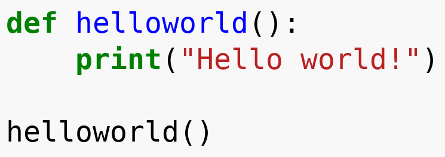

# ocrexec

Execute pictures of code.

## Dependencies

### Arch Linux
Install tesseract:
```
 $ sudo pacman -S tesseract tesseract-data-eng
```

Setup Python virtual environment and install dependencies
```
 $ python -m venv venv
 $ source ./venv/bin/activate
 $ pip install -r requirements.txt
```

### Debian/Ubuntu
Install tesseract on Debian/Ubuntu:
```
 $ sudo apt-get install tesseract-ocr tesseract-ocr-eng
```

Setup Python virtual environment and install dependencies
```
 $ sudo apt-get install python3-venv
 $ python3 -m venv venv
 $ source ./venv/bin/activate
 $ pip3 install -r requirements.txt
```

## Usage

To execute the code in `helloworld.png`



call the script like this:

```
 $ ./ocrexec.py -i helloworld.png
 [...]
 --------------------
 Output:
 --------------------
 Hello worldl
 --------------------
```
(Close enough...)
